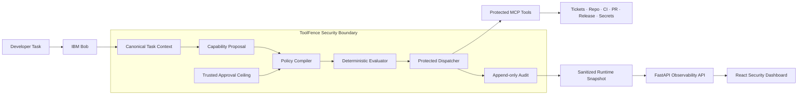
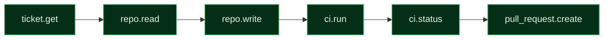
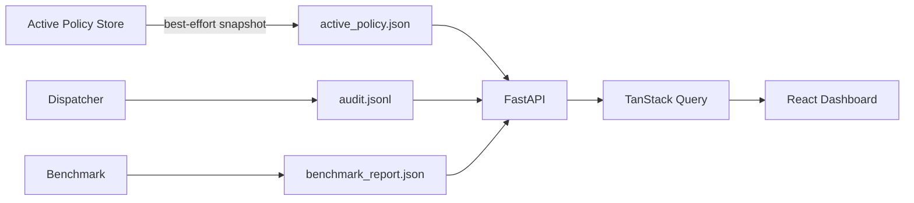
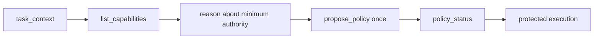

<div align="center">


<a href="https://lablab.ai/">
  
</a>


<br/><br/>


<br/>

**A deterministic security gateway that gives AI coding agents exactly the authority required for one task — and no more.**

<br/>

[**Architecture**](#-architecture) •
[**Golden Demo**](#-golden-demo) •
[**Dashboard**](#-security-dashboard) •
[**Benchmark**](#-benchmark) •
[**Quick Start**](#-quick-start) •
[**Security Model**](#-security-model)

</div>

---

## ✦ At a Glance

<div align="center">

| Security Surface | Measured Result |
|:---|:---:|
| 🧩 Protected capabilities | **11** |
| ✅ Granted for the golden task | **6** |
| 🛡️ Privilege reduction | **45.45%** |
| 🧪 Benchmark cases matched | **16 / 16** |
| 🚫 Forbidden-action blocking | **100%** |
| 🎯 Boundary-case accuracy | **100%** |
| ⚠️ False-denial rate | **0%** |
| ⚡ Mean policy evaluation | **0.0205 ms** |

</div>

> **Security invariant:** the model may reason about permissions, but it never becomes the final authority for protected execution.

---

## 🧠 Why ToolFence Exists

AI coding agents are increasingly capable, but their tool access is often much broader than the task actually requires.

<table>
<tr>
<td width="50%" valign="top">

### ❌ Typical Agent Model

An agent may receive broad access to:

- source repositories
- ticket systems
- CI pipelines
- pull requests
- deployment tools
- secret stores
- production-facing systems

Even if the current task only requires a small subset.

</td>
<td width="50%" valign="top">

### ✅ ToolFence Model

ToolFence turns a task into a **temporary capability boundary**:

- Bob proposes the minimum authority
- trusted approval stays separate
- ToolFence validates the proposal
- every call is checked deterministically
- out-of-scope actions are denied
- decisions are auditable

</td>
</tr>
</table>

<div align="center">

```text
Broad agent authority
        ↓
Task-specific proposal
        ↓
Trusted validation
        ↓
Minimal active policy
        ↓
Deterministic enforcement
```

</div>

---

## 🔐 Core Principle

<div align="center">

### **Bob reasons. ToolFence enforces.**

</div>

IBM Bob can reason about what permissions are useful for a task.

ToolFence independently decides whether those permissions — and every subsequent protected tool call — are allowed.

```text
LLM reasoning ≠ authorization authority
```

---

## 🏗 Architecture



### Three intentionally separate planes

| Plane | Responsibility | Trust Property |
|---|---|---|
| **Control plane** | task identity, approval ceiling, proposal validation, policy lifecycle | trusted configuration |
| **Data plane** | argument validation, resource derivation, ALLOW/DENY, execution, audit | deterministic enforcement |
| **Observability plane** | runtime snapshot, audit reading, benchmark reading, dashboard | **read-only; never authorizes** |

> The FastAPI dashboard bridge is observability-only. Authorization continues to use the trusted in-memory policy store inside the ToolFence MCP process.

---

## 🧬 Trust Model

ToolFence separates three concepts that must never be collapsed into one.

### 1 — Canonical task context

```json
{
  "task_id": "BUG-17-FIX",
  "task": "Fix BUG-17, run CI, and create a pull request."
}
```

The agent receives the canonical task identity, **not** the developer approval ceiling.

### 2 — Agent capability proposal

Bob reasons about the minimum access required:

```json
{
  "task": "Fix BUG-17, run CI, and create a pull request.",
  "allowed": [
    { "tool": "ticket.get", "resource": "BUG-17" },
    { "tool": "repo.read", "resource": "project/*" },
    { "tool": "repo.write", "resource": "project/src/*" },
    { "tool": "ci.run", "resource": "feature/BUG-17" },
    { "tool": "ci.status", "resource": "feature/BUG-17" },
    { "tool": "pull_request.create", "resource": "feature/BUG-17" }
  ]
}
```

### 3 — Trusted developer approval ceiling

A separately trusted approval defines the **maximum authority** the task may receive.

Bob cannot supply this ceiling. ToolFence validates the proposal against it before activating a policy.

---

## 🧱 Fail-Closed Enforcement

<table>
<tr>
<td><b>Condition</b></td>
<td><b>ToolFence decision</b></td>
<td><b>Execution</b></td>
</tr>
<tr>
<td>No active policy</td>
<td>🔴 <b>DENY</b></td>
<td>Not forwarded</td>
</tr>
<tr>
<td>Tool not granted</td>
<td>🔴 <b>DENY</b></td>
<td>Not forwarded</td>
</tr>
<tr>
<td>Resource outside scope</td>
<td>🔴 <b>DENY</b></td>
<td>Not forwarded</td>
</tr>
<tr>
<td>Malformed arguments</td>
<td>🔴 <b>DENY</b></td>
<td>Not forwarded</td>
</tr>
<tr>
<td>Unknown capability</td>
<td>🔴 <b>DENY</b></td>
<td>Not forwarded</td>
</tr>
<tr>
<td>Valid task-scoped request</td>
<td>🟢 <b>ALLOW</b></td>
<td>Protected backend may execute</td>
</tr>
</table>

---

## 🎯 Golden Demo

### Task

```text
Fix BUG-17, run CI, and create a pull request.
```

### Active task capability contract

| Tool | Resource Scope | Status |
|---|---|:---:|
| `ticket.get` | `BUG-17` | 🟢 Granted |
| `repo.read` | `project/*` | 🟢 Granted |
| `repo.write` | `project/src/*` | 🟢 Granted |
| `ci.run` | `feature/BUG-17` | 🟢 Granted |
| `ci.status` | `feature/BUG-17` | 🟢 Granted |
| `pull_request.create` | `feature/BUG-17` | 🟢 Granted |
| `ticket.comment` | — | 🔴 Excluded |
| `ticket.delete` | — | 🔴 Excluded |
| `release.status` | — | 🔴 Excluded |
| `release.deploy` | — | 🔴 Excluded |
| `secret.read` | — | 🔴 Excluded |

### Real denial

Bob attempted:

```text
secret.read
resource: production-key
```

ToolFence returned:

```json
{
  "decision": "DENY",
  "reason_code": "TOOL_NOT_GRANTED",
  "execution_status": "NOT_EXECUTED",
  "result": null
}
```

> 🔒 The secret backend was **not executed**.

### Real end-to-end execution



The protected workflow successfully read the ticket, inspected the repository, fixed `BUG-17`, ran CI, verified the result, and created a pull request.

### BUG-17

Before:

```python
def calculate_total(prices):
    return sum(prices[1:])
```

After:

```python
def calculate_total(prices):
    return sum(prices)
```

### Protected CI result

| Check | Input | Expected | Result |
|---|---|---:|---:|
| `multiple_items` | `[10, 20, 30]` | `60` | `60` |
| `empty_cart` | `[]` | `0` | `0` |
| `single_item` | `[25]` | `25` | `25` |

**Final CI status:** 🟢 `PASSED`

---

## 📊 Security Dashboard

ToolFence includes a live **React + TypeScript security console** backed by the read-only FastAPI observability bridge.

| Route | Workspace | What it shows |
|---|---|---|
| `/dashboard` | **Overview** | task, policy state, privilege reduction, latest request |
| `/dashboard/policy` | **Policy** | active contract, granted/excluded capabilities, scope boundaries |
| `/dashboard/activity` | **Activity** | protected-tool timeline, decisions, execution state |
| `/dashboard/audit` | **Audit** | authorization evidence, reason codes, policy IDs |
| `/dashboard/benchmark` | **Benchmark** | replay accuracy, blocking, false denials, latency |

The dashboard uses **nested React Router routes**, so the sidebar and header remain persistent while only the workspace changes.

### Runtime observability flow



> The snapshot is evidence for visualization. It is **not** an authorization source.

---

## ⚡ Benchmark

ToolFence includes a deterministic replay benchmark with **16 predefined authorization scenarios**.

<div align="center">


</div>

<br/>

| Metric | Result |
|---|---:|
| Cases matched | **16 / 16** |
| Ground-truth match rate | **100.00%** |
| Forbidden-action blocking rate | **100.00%** |
| False-denial rate | **0.00%** |
| Boundary-case accuracy | **100.00%** |
| Privilege reduction | **45.45%** |
| Mean authorization evaluation | **0.0205 ms** |
| Max authorization evaluation | **0.0525 ms** |

> Latency here means **authorization policy-evaluation time**, not end-to-end IBM Bob, MCP, HTTP, network, or backend execution latency.

Run it:

```powershell
.\.venv\Scripts\python.exe -m benchmark.run_benchmark
```

---

## 🧰 MCP Surface

ToolFence exposes **15 MCP tools** in total.

### Protected capabilities — 11

<details>
<summary><b>Expand protected capability inventory</b></summary>

<br/>

| Service | Capability |
|---|---|
| Ticket | `ticket.get` |
| Ticket | `ticket.comment` |
| Ticket | `ticket.delete` |
| Repository | `repo.read` |
| Repository | `repo.write` |
| Pull Request | `pull_request.create` |
| CI | `ci.run` |
| CI | `ci.status` |
| Release | `release.status` |
| Release | `release.deploy` |
| Secrets | `secret.read` |

</details>

### Control plane — 4

```text
toolfence.list_capabilities
toolfence.task_context
toolfence.propose_policy
toolfence.policy_status
```

---

## 🤖 IBM Bob Integration

ToolFence runs as a real MCP STDIO server.

```text
.bob/mcp.json
app/mcp_stdio.py
```

Bob's secure workflow:



The included project skill lives at:

```text
.bob/skills/compile-task-policy/SKILL.md
```

It instructs Bob not to:

- inspect trusted approval configuration
- discover approval limits through shell commands
- probe policy proposals incrementally
- bypass ToolFence after a denial
- use alternate protected-action routes when ToolFence should mediate them

---

## 🌐 FastAPI Observability API

Start the read-only API:

```powershell
.\.venv\Scripts\python.exe -m uvicorn app.api.main:app --host 127.0.0.1 --port 8000 --reload
```

| Endpoint | Purpose |
|---|---|
| `GET /api/health` | API health |
| `GET /api/task` | canonical task context |
| `GET /api/policy` | runtime policy snapshot |
| `GET /api/capabilities` | inventory + effective grants |
| `GET /api/audit` | authorization evidence |
| `GET /api/benchmark` | benchmark metrics |

Interactive docs:

```text
http://127.0.0.1:8000/docs
```

---

## 🛠 Tech Stack

<div align="center">

### Security & Backend


<br/><br/>


### Frontend


<br/><br/>


### Platform & Workflow


<br/><br/>


</div>

---

## 🚀 Quick Start

### 1. Clone

```powershell
git clone https://github.com/builtbyrehan/toolfence.git
cd toolfence
```

### 2. Python environment

```powershell
python -m venv .venv
.\.venv\Scripts\Activate.ps1
python -m pip install --upgrade pip
pip install -e ".[dev]"
```

### 3. Run tests

```powershell
.\.venv\Scripts\python.exe -m pytest -q
```

### 4. Run benchmark

```powershell
.\.venv\Scripts\python.exe -m benchmark.run_benchmark
```

### 5. Start ToolFence MCP

```powershell
.\.venv\Scripts\python.exe -m app.mcp_stdio
```

### 6. Start dashboard API

In a second terminal:

```powershell
.\.venv\Scripts\python.exe -m uvicorn app.api.main:app --host 127.0.0.1 --port 8000 --reload
```

### 7. Start frontend

In a third terminal:

```powershell
cd frontend
npm install
npm run dev
```

Open:

```text
http://127.0.0.1:5173/
http://127.0.0.1:5173/dashboard
```

---

## 🧪 IBM Bob MCP Configuration

```json
{
  "mcpServers": {
    "toolfence": {
      "command": "${workspaceFolder}/.venv/Scripts/python.exe",
      "args": [
        "-m",
        "app.mcp_stdio"
      ],
      "cwd": "${workspaceFolder}",
      "disabled": false
    }
  }
}
```

After connecting ToolFence, start a fresh Bob task so the current MCP tool schema is loaded.

---

## 🗂 Project Structure

<details>
<summary><b>Expand repository structure</b></summary>

<br/>

```text
toolfence/
├── .bob/
│   ├── mcp.json
│   └── skills/
│       └── compile-task-policy/
│           └── SKILL.md
│
├── app/
│   ├── api/
│   │   ├── main.py
│   │   ├── routes/
│   │   ├── schemas/
│   │   └── services/
│   ├── gateway/
│   │   ├── audit.py
│   │   ├── dispatcher.py
│   │   └── mcp_server.py
│   ├── policy/
│   │   ├── compiler.py
│   │   ├── controller.py
│   │   ├── evaluator.py
│   │   ├── matcher.py
│   │   ├── runtime_snapshot.py
│   │   ├── schema.py
│   │   ├── snapshot_store.py
│   │   └── store.py
│   ├── application.py
│   ├── bootstrap.py
│   └── mcp_stdio.py
│
├── benchmark/
│   ├── ground_truth.json
│   └── run_benchmark.py
│
├── config/
│   ├── capabilities.json
│   └── golden_task.json
│
├── frontend/
│   ├── src/
│   │   ├── app/
│   │   ├── api/
│   │   ├── components/
│   │   ├── features/
│   │   ├── hooks/
│   │   ├── pages/
│   │   │   ├── landing/
│   │   │   └── dashboard/
│   │   ├── styles/
│   │   └── types/
│   ├── vite.config.ts
│   └── vercel.json
│
├── mock_mcp/
├── runtime/
│   ├── active_policy.json
│   ├── audit.jsonl
│   └── benchmark_report.json
│
├── tests/
├── pyproject.toml
└── README.md
```

</details>

---

## 🛡 Security Model

### Security properties

- **Task-scoped authorization** — permissions belong to one task.
- **Least privilege** — Bob proposes only what the task requires.
- **Trusted approval boundary** — the model cannot supply its own approval ceiling.
- **Deterministic enforcement** — the LLM does not make the final ALLOW/DENY decision.
- **Resource-scoped permissions** — a tool may be allowed for one path and denied for another.
- **Auditable decisions** — validated protected requests generate audit evidence.
- **Read-only observability** — the dashboard cannot grant execution authority.
- **Authorization/execution separation** — an ALLOW decision is distinct from backend success or domain success.

Example:

```text
repo.write project/src/*
→ ALLOW

repo.write project/tests/*
→ DENY
```

### Current MVP boundary

> [!IMPORTANT]
> ToolFence protects calls routed through the **ToolFence MCP gateway**. It does **not** provide operating-system-level sandboxing of IBM Bob itself.

If the host separately exposes local shell access, native filesystem access, or unrelated integrations, this MVP does not technically prevent Bob from using those alternate paths.

The Bob skill instructs the agent not to bypass ToolFence, but behavioral guidance is not equivalent to host-level isolation.

### Non-goals

This hackathon MVP does not claim to provide:

- OS-level sandboxing
- full endpoint security
- production secret management
- production deployment authorization
- enterprise identity federation
- a general-purpose policy language
- complete protection from every alternate host-side tool path

---

## 🎬 Demo Story

```text
01  Developer gives Bob a normal coding task.
02  Bob reads the canonical task context.
03  Bob inspects available capabilities.
04  Bob proposes only the minimum required authority.
05  ToolFence validates against a hidden trusted ceiling.
06  ToolFence activates an immutable task policy.
07  Bob attempts a forbidden secret read.
08  ToolFence returns DENY / NOT_EXECUTED.
09  Bob executes the legitimate bug-fix workflow.
10  ToolFence allows only approved actions.
11  CI passes.
12  Pull request is created.
13  Every protected action is auditable.
14  Dashboard visualizes policy, activity, audit, and benchmark evidence.
```

---

## 🧭 Roadmap

- [ ] richer policy lifecycle controls
- [ ] human-approved policy changes
- [ ] signed task approvals
- [ ] durable multi-task policy persistence
- [ ] persistent structured audit backend
- [ ] real GitHub / GitLab integration
- [ ] real CI provider integration
- [ ] enterprise identity integration
- [ ] capability risk scoring
- [ ] organization-wide policy templates
- [ ] host-level sandbox integration
- [ ] multi-agent support
- [ ] real-world replay datasets
- [ ] production authentication for dashboard/API
- [ ] real-time audit streaming with SSE or WebSockets

---

## 🏁 Key Result

<div align="center">

```text
11 protected capabilities available
              ↓
6 capabilities granted for this task
              ↓
Forbidden actions blocked
              ↓
Legitimate task completed
              ↓
Every protected action audited
              ↓
Runtime security state visualized
```

### **Task-scoped security without removing agent autonomy.**

<br/>

<a href="https://github.com/builtbyrehan/toolfence">
  
</a>

<br/><br/>

<sub>Built for the IBM Bob 2.0 Hackathon on lablab.ai.</sub>

<br/><br/>


</div>
